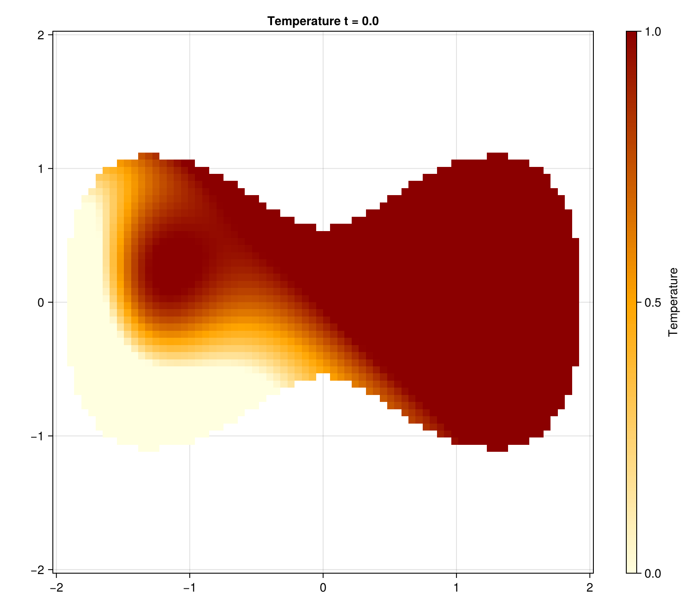
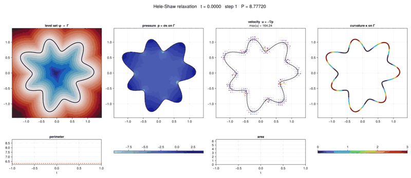

# EvolvingDomains 0.3

**A Julia package for solving PDEs on moving domains.**

Mini package intended to provide a set of utilities to write 2D multiphysics moving domain problems in the gridap ecosystem. It leverages `GridapEmbedded`.

The paradigm the package is built on is a decoupling between kinematics and dynamics. In particular the package provides tools to handle the kinematics side by dedicated geometric structures. The dynamics part is intended to be handled on the active mesh by FEM solving with `GridapEmbedded`. That is because we want to keep the package deliberately low-level, you should know how you solve your linear systems and further have a precise control over it. The package thus provide functionalities wrapped around `GridapEmbedded` however it stays at the data-structure layer thus you could use it with any solver compatible.

The examples below use the public submodule APIs explicitly:

```julia
using EvolvingDomains
using EvolvingDomains.Geometric: CartesianMeshField, get_active_indices
using EvolvingDomains.Kinematic: TransportMap, advect!
using EvolvingDomains.Transfer: grid_to_mesh, mesh_to_grid
using Gridap: VectorValue
```

## Geometric

The basic object of the package is the `EvolvingDiscreteGeometry`. It is an all-in-one object for basic routines regarding implicitly defined level-set geometry that evolves.

In particular it provides the following functionalities:

- **Reinitialization of the level set** to a signed distance function.

  After advection the level-set gradient `|∇φ|` drifts away from 1. Reinitialization restores the signed distance property by solving the Eikonal equation `|∇φ| = 1` on the background grid.
  The implementation uses the **Fast Sweeping Method** (Zhao 2005). Nodes of cut cells are anchored with `|φ|/g`, where `g` is one median gradient scale shared by all anchors so that linearly reconstructed edge crossings are preserved. Four alternating-direction sweeps then propagate the distance outward.

  ```julia
  reinitialize!(geom)   # restores |∇φ| ≈ 1 everywhere
  ```

- **A lazy cache system** for stencils and derived data.

  `EvolvingDiscreteGeometry` holds a `GeometryCache` that stores the GridapEmbedded cut geometry, the active node set, and the transfer and extension operators. Cache-aware mutating operations such as `set_levelset!` and `reinitialize!` invalidate derived entries, which are recomputed on first access. Direct mutation of `geom.levelset` is deliberately low-level and must be followed by `invalidate!(geom.cache)`.

  ```julia
  set_levelset!(geom, phi_new)        # updates φ, invalidates all cache entries
  indices = get_active_indices(geom)  # recomputes and caches active IN+CUT nodes
  ```
  **Active indices** are used to couple effectively with the CutFEM method provided by `GridapEmbedded`.

  Many moving domain problems involve fields living on the geometry. To handle this the package provides a dedicated structure `CartesianMeshField`. It wraps the flat nodal data array and provides clamped 2D indexing and a bilinear interpolant (via `get_interpolator`), which is used internally by both the WENO5 stencils and the transfer operators.


- **A robust explicit curvature handling** 

  Because curvature is an essential modeling asset, we provide a simple way to compute it from the evolving discrete geometry. Our goal is to provide a simple method for fast prototpying, However to fit the low level philosophy, it's not plug and play for a semi implicit approach.

- **A Topological filter**
  To remove subgrid artifcats we have a dedicated topological filter, together with reinitialization of the SDF property, this module is to restore good health of the level set function.

- **Convenient in-REPL geometry plotting**
  The package expose a simple `plot` function for `EvolvingDiscreteGeometry`that will render a coarse view of the geometry in the Julia REPL.

## Kinematics

The package provides two distinct transport operators.

### Level-set advection — WENO5 + SSP-RK3

The first operator advances the level set by solving `∂φ/∂t + v·∇φ = 0`. 

The spatial discretization uses the **fifth-order WENO** scheme (Jiang & Shu 1996) with Jiang-Peng smoothness indicators (Jiang & Peng 2000): at each node the upwind-biased directional derivative is selected based on the sign of `v`, and non-linear weights suppress oscillations near discontinuities while recovering fifth-order accuracy on smooth regions. 

Time integration uses the **third-order Strong-Stability-Preserving Runge-Kutta** (SSP-RK3, Shu & Osher 1988).

It can be used with any well-defined velocity field, sampled onto the grid via `sample_velocity`:

```julia
vel = StaticFunctionVelocity(x -> VectorValue(-ω*(x[2]-0.5), ω*(x[1]-0.5)))
v_field = sample_velocity(vel, grid_info(grid), t)
advance!(geom, v_field, Δt)   # WENO5 + SSP-RK3 step on the level set
```

### Field advection — Conservative Semi-Lagrangian (CCISL)

The second operator advects fields coupled to the deforming geometry. It implements the **Conservative Cell-Integrated Semi-Lagrangian** method (Lentine, Grétarsson & Fedkiw 2011). Its velocity source is treated as a frozen spatial field during each step; sample or wrap the velocity at the desired time before constructing the map. The current cut must be materialized before updating the level set, allowing `set_levelset!` or `advance!` to preserve it as the source geometry.

```julia
ensure_cut!(geom)                              # preserve Ωⁿ on the next update
advance!(geom, v_field, Δt)                    # construct Ωⁿ⁺¹
k_map = TransportMap(geom, vel, Δt)           # build the transport map (geometry-aware)
advect!(new_data, current_field.data, k_map)  # apply it to any scalar field
```

The main drawback of this method is significant numerical diffusion. See the rotating checkerboard test `TestConservativeTransport.jl` for a illustration.

## Transfer

The most critical capability in hybrid workflows (also found in multigrid methods) is accurate transfer between different levels of discretization. The package provides a `GridMeshTransfer` operator that follows the `TransferOperator.jl` protocol, exposing two directions:

- **`restrict` (Grid → Mesh):** evaluates the `CartesianMeshField` at FE mesh nodes via bilinear interpolation, then projects into the target `FESpace` using Gridap's `interpolate`.
- **`prolong` (Mesh → Grid):** maps DOF values back onto the background grid using direct index mapping when the mesh topology allows it, falling back to batch point evaluation otherwise.

```julia
transfer_op = setup_transfer(geom, V)      # V is the current AgFEM FESpace
u_mesh = grid_to_mesh(geom, u_grid)        # restrict: Cartesian field → FE function
u_grid = mesh_to_grid(geom, u_mesh)        # prolong:  FE function  → Cartesian field
```

## License
MIT License — see [LICENSE](LICENSE) for details.

## Examples
For a full working example see `TestDumbellParabolic.jl` that recreates a test case from the 2025 paper of Olshanskii & Reusken. [arXiv:2504.14116](https://arxiv.org/pdf/2504.14116)



See also an explicit implementation of Hele-Shaw with surface tension `TestHeleShawST.jl` inspired by the 2024 paper of Lavi, Meunier & Pantz that makes use of our new curvature module ! 



## Developer note 

If you are interested in this work please feel free to contact me at: `naoufel.cresson@inria.fr`

my personal page: https://www.ljll.fr/~cresson/
