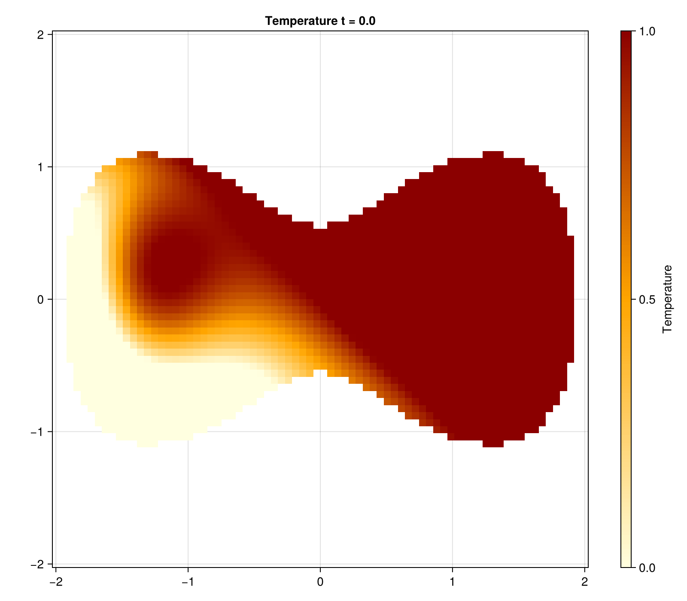

#   EvolvingDomains.jl

**A Julia package for solving PDEs on moving domains.**

This package provide a set of utilities to write 2D multiphysics moving domain problems.

The paradigm the package is built on is a decoupling between kinematics and dynamics. 

The package provides tools to handle the kinematics side by dedicated geometric structures. The dynamics part is intended to be handled on the active mesh, the package remain at the data-structure level, so you can proceed any way you like.  

In particular, the package was designed to work within the [`Gridap`](https://github.com/gridap/Gridap.jl) ecosystem and specifically their embedded finite element extension [`GridapEmbedded`](https://github.com/gridap/GridapEmbedded.jl).

`EvolvingDomains` is a registered package ! You can install it via the Julia REPL

```julia
# Type ] to enter package mode
pkg> add EvolvingDomains 
```

For a full working example see `TestDumbellParabolic.jl` that recreates a test case from the 2025 paper of Olshanskii & Reusken. [arXiv:2504.14116](https://arxiv.org/pdf/2504.14116)



# Features

## Geometric

The basic object of the package is the `EvolvingDiscreteGeometry`. It is an all-in-one object for basic routines regarding implicitly defined level-set geometry that evolves.

In particular it provides the following functionalities:

- **Reinitialization of the level set** to a signed distance function.

  After advection the level-set gradient `|∇φ|` drifts away from 1. Reinitialization restores the signed distance property by solving the Eikonal equation `|∇φ| = 1` on the background grid.
  The implementation uses the **Fast Sweeping Method** (Zhao 2005).

  ```julia
  reinitialize!(geom)   # restores |∇φ| ≈ 1 everywhere
  ```

- **A lazy cache system** for stencils and derived data.

  `EvolvingDiscreteGeometry` holds a `GeometryCache` that stores the GridapEmbedded cut geometry, the active node set, and the transfer and extension operators. Cache-aware mutating operations such as `set_levelset!` and `reinitialize!` invalidate derived entries, which are recomputed on first access. Direct mutation of `geom.levelset` is deliberately low-level and must be followed by `invalidate!(geom.cache)`.

  ```julia
  set_levelset!(geom, phi_new)        # updates φ, invalidates all cache entries
  indices = get_active_indices(geom)  # recomputes and caches active IN+CUT nodes
  ```
  **Active indices** are used to couple effectively with the CutFEM method provided by `GridapEmbedded`.

  Many moving domain problems involve fields living on the geometry. To handle this the package provides a dedicated structure `CartesianMeshField`. It wraps the flat nodal data array and provides clamped 2D indexing and a bilinear interpolant (via `get_interpolator`), which is used internally by both the WENO5 stencils and the transfer operators.


- **A robust explicit curvature handling** 

  Because curvature is an essential modeling asset, we provide a simple way to compute it from the evolving discrete geometry. Our goal is to provide a simple method for fast prototpying, However to fit the low level philosophy, it's not plug and play for a semi implicit approach.

- **A Topological filter**
  To remove subgrid artifcats we have a dedicated topological filter, together with reinitialization of the SDF property, this module is to restore good health of the level set function.

- **Terminal plotting with TPlot.jl**
  `plot(geom; ...)` and `plot(geom, t, y; ...)` retain the existing terminal display through the standalone TPlot package.
  TPlot also supports weighted, nested layouts with independent curve axes:

  ```julia
  using TPlot
  scene = Row(Geometry(geom), Column(
      Curves(t, density_history; title="density"),
      Curves(t, stress_history; title="stress")); weights=(1, 1))
  render(scene; label="simulation")
  ```

  `Geometry(geom)` retains a view of the level-set values. Update those values in place and render the same tree again.
  Each render adapts to the current terminal size. See [TPlot's README](../TPlot.jl/README.md) for field ordering and layout options.

  TPlot is not registered yet. For this development stack, run `julia setup_stack.jl` from the stack root.
  With Julia 1.10, develop the local TPlot package explicitly before resolving EvolvingDomains:

  ```julia
  using Pkg
  Pkg.develop(path="../TPlot.jl")  # from the EvolvingDomains project directory
  Pkg.instantiate()
  ```

## Kinematics

The package distinguishes geometry evolution, intensive transport, and conservative
redistribution. For a material scalar `c` and a conserved density `q`, respectively,

```math
\partial_t c + v\cdot\nabla c = 0,
\qquad
\partial_t q + \nabla\cdot(qv) = 0.
```

### Level-set advection — WENO5 + SSP-RK3

The first operator advances the level set by solving `∂φ/∂t + v·∇φ = 0`. 

The spatial discretization uses the **fifth-order WENO** scheme (Jiang & Shu 1996) with Jiang-Peng smoothness indicators (Jiang & Peng 2000): at each node the upwind-biased directional derivative is selected based on the sign of `v`, and non-linear weights suppress oscillations near discontinuities while recovering fifth-order accuracy on smooth regions. 

Time integration uses the **third-order Strong-Stability-Preserving Runge-Kutta** (SSP-RK3, Shu & Osher 1988).

It can be used with any well-defined velocity field, sampled onto the grid via `sample_velocity`:

```julia
using EvolvingDomains.Geometric: CartesianMeshField

vel = StaticFunctionVelocity(x -> VectorValue(-ω*(x[2]-0.5), ω*(x[1]-0.5)))
v_nodes = sample_velocity(vel, grid_info(grid), t)
v_field = CartesianMeshField(v_nodes, grid_info(grid))
advance!(geom, v_field, Δt)   # WENO5 + SSP-RK3 step on the level set
```

### Intensive field advection — CIP

The velocity-based `advect!` overload transports intensive scalars with directionally
split Constrained Interpolation Profile (CIP). This implementation uses a first-order
x-then-y Lie split with Euler characteristics. The velocity is a frozen nodal vector
field for the step, normally the same sampled field passed to `advance!`.
Bare velocity vectors are interpreted in the source field's grid ordering; wrapping the
velocity in a `CartesianMeshField` additionally validates its grid metadata.

```julia
next = CartesianMeshField(similar(current.data), current.grid)
advect!(next, current, v_field, Δt)  # type=:intensive is the default
```

Without a cache, the Hermite interpolation profile is reconstructed from `current`
on every call. An optional cache carries the profile and reuses all scratch arrays:

```julia
cache = CIPCache(current)
for step in 1:nsteps
    advect!(next, current, v_field, Δt; cache=cache)
    current, next = next, current
end
```

The cache keeps a snapshot of its last output. If another operator changes the next
source field, `advect!` detects the changed nodal values and rebuilds the profile.
Cached and uncached repeated transport are different discretizations: the cached form
carries the CIP moments, while the uncached form reconstructs them each step.

Standard CIP is not monotone and can overshoot near discontinuities. Source and target
must not alias, and departure points must remain inside the background grid; prescribed
outer-boundary inflow is not currently supported. CIP operates on the complete Cartesian
field rather than the active geometry mask, so fields defined only inside a moving domain
must be extended before transport. A step is rejected if its discrete directional
characteristics cross; subdivide that step instead.

### Field advection — Conservative Semi-Lagrangian (CCISL)

The conservative overload advects fields coupled to the deforming geometry. It implements
the **Conservative Cell-Integrated Semi-Lagrangian** method (Lentine, Grétarsson & Fedkiw
2011). `TransportMap` consumes the same frozen nodal velocity used for geometry evolution.
The current cut must be materialized before updating the level set, allowing
`set_levelset!` or `advance!` to preserve it as the source geometry.

```julia
ensure_cut!(geom)                               # preserve Ωⁿ on the next update
advance!(geom, v_field, Δt)                     # construct Ωⁿ⁺¹
k_map = TransportMap(geom, v_field, Δt)         # validates velocity grid metadata
advect!(new_field, current_field, k_map; type=:conservative)
```

The three-argument `advect!(target, source, map)` remains conservative for compatibility,
but the explicit keyword is preferred. For a valid map, the implemented invariant is the
sum over its source support. The main drawback is significant numerical diffusion; see
the rotating checkerboard test `TestConservativeTransport.jl`.
Raw velocity and scalar vectors remain supported, but carry no grid metadata; their
ordering is assumed to match the map's Cartesian grid.

## Transfer

The most critical capability in hybrid workflows (also found in multigrid methods) is accurate transfer between different levels of discretization. The package provides a `GridMeshTransfer` operator that follows the `TransferOperator.jl` protocol, exposing two directions:

- **`restrict` (Grid → Mesh):** evaluates the `CartesianMeshField` at FE mesh nodes via bilinear interpolation, then projects into the target `FESpace` using Gridap's `interpolate`.
- **`prolong` (Mesh → Grid):** maps DOF values back onto the background grid using direct index mapping when the mesh topology allows it, falling back to batch point evaluation otherwise.

```julia
transfer_op = setup_transfer(geom, V)      # V is the current AgFEM FESpace
u_mesh = grid_to_mesh(geom, u_grid)        # restrict: Cartesian field → FE function
u_grid = mesh_to_grid(geom, u_mesh)        # prolong:  FE function  → Cartesian field
```

## Developer note 

If you are interested in this work please feel free to contact me at: `naoufel.cresson@inria.fr`

my personal page: https://www.ljll.fr/~cresson/

# License
MIT License — see [LICENSE](LICENSE) for details.
