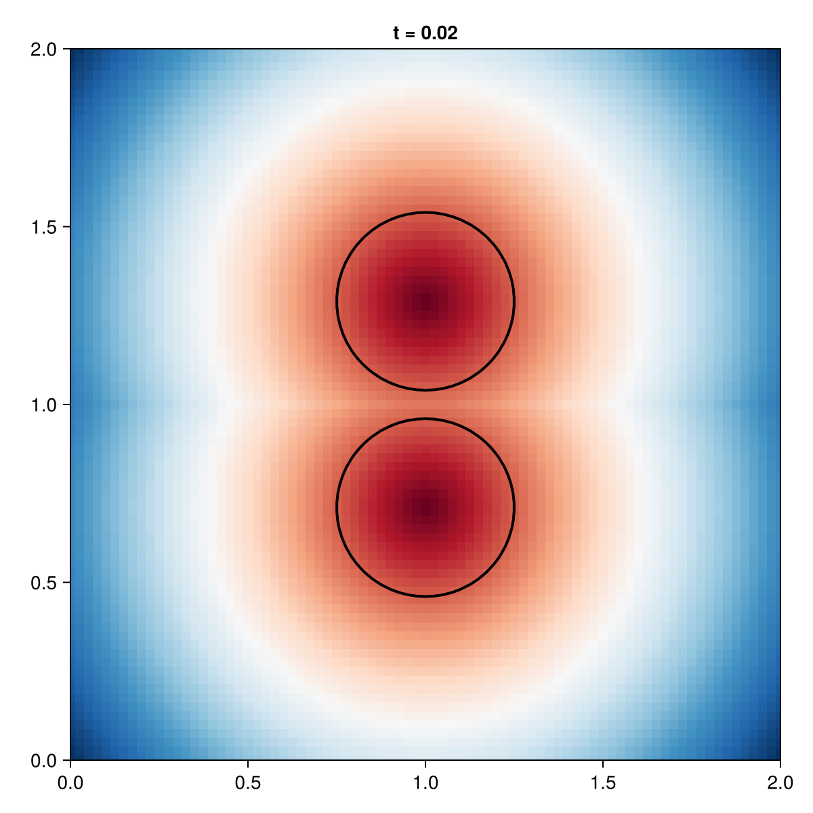

```@meta
EditURL = "../../../examples/colliding_balls_minimal.jl"
```

=============================================================================
Colliding Balls — Minimal Example
=============================================================================

Topology change demonstration: Two balls approach and merge.
Demonstrates: Shock handling, domain union, level set method's ability
to handle topological changes naturally.

=============================================================================

````@example colliding_balls_minimal
using EvolvingDomains
using Gridap
using LevelSetMethods
using CairoMakie

println("═" ^ 60)
println("  Colliding Balls — EvolvingDomains.jl V2")
println("═" ^ 60)
````

1. Setup Grid

````@example colliding_balls_minimal
domain = (0.0, 2.0, 0.0, 2.0)
n = 80
model = CartesianDiscreteModel(domain, (n, n))
````

2. Two Balls (Union)

````@example colliding_balls_minimal
ball_top = EvolvingDomains.Circle(VectorValue(1.0, 1.3), 0.25)
ball_bot = EvolvingDomains.Circle(VectorValue(1.0, 0.7), 0.25)
two_balls = union(ball_top, ball_bot)
````

3. Create Evolving Geometry

````@example colliding_balls_minimal
geom = EvolvingDiscreteGeometry(model,
    x -> two_balls(VectorValue(x...));
    reinit_freq = 5
)
````

4. Discontinuous Velocity: Balls move toward each other
Top half moves down, bottom half moves up

````@example colliding_balls_minimal
function collision_velocity(x, t)
    if x[2] > 1.0
        return (0.0, -0.5)  # Move down
    else
        return (0.0, 0.5)   # Move up
    end
end
set_velocity!(geom, TimeDependentVelocity(collision_velocity))
````

5. Simulation Parameters

````@example colliding_balls_minimal
t_end = 1.0  # Balls merge around t ≈ 0.6
dt = 0.02
n_steps = round(Int, t_end / dt)

println("Grid: $(n)×$(n), Δt = $dt, Steps = $n_steps")
println("Target: Balls merge mid-simulation")
println("")
````

6. Record Animation

````@example colliding_balls_minimal
fig = Figure(size=(600, 600))
ax = Axis(fig[1, 1], aspect=1, limits=(0, 2, 0, 2),
            title="Colliding Balls")

output_path = joinpath(@__DIR__, "colliding_balls_minimal.gif")

record(fig, output_path, 1:n_steps; framerate=15) do step
    advance!(geom, dt)
    empty!(ax)
    plot_levelset!(ax, geom)
    ax.title = "t = $(round(EvolvingDomains.current_time(geom), digits=2))"
end

println("✅ Animation saved to: $output_path")
println("═" ^ 60)
````



---

*This page was generated using [Literate.jl](https://github.com/fredrikekre/Literate.jl).*

