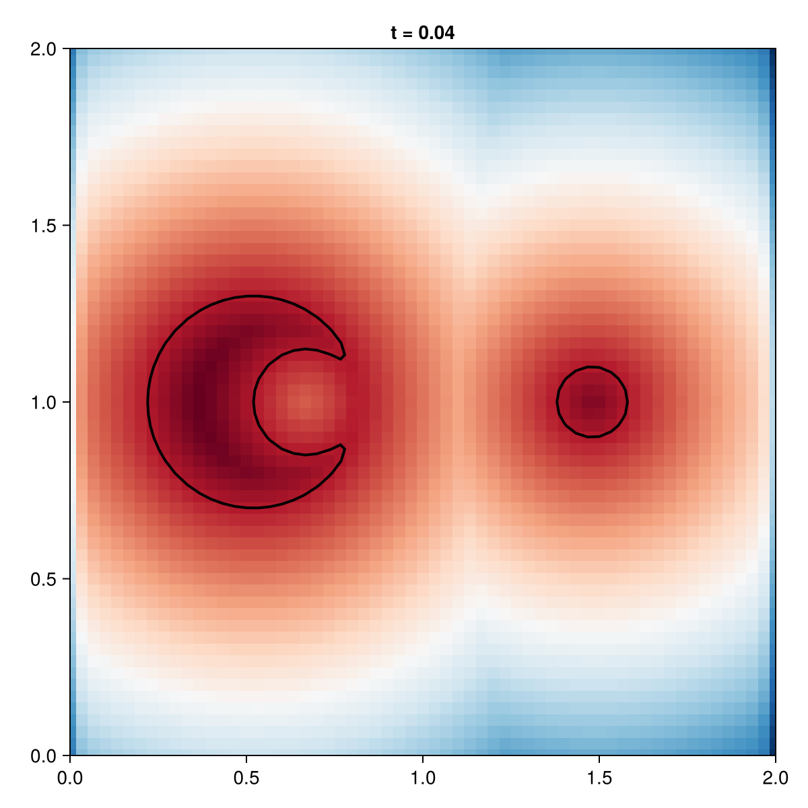

```@meta
EditURL = "../../../examples/independent_motion_minimal.jl"
```

=============================================================================
Independent Motion — Minimal Example
=============================================================================

Multi-level set pattern: Objects with independent velocities.
Demonstrates: How to simulate objects passing through each other
without forced merging (each has its own level set).

=============================================================================

````@example independent_motion_minimal
using EvolvingDomains
using Gridap
using LevelSetMethods
using CairoMakie

println("═" ^ 60)
println("  Independent Motion — EvolvingDomains.jl V2")
println("═" ^ 60)
````

1. Setup Grid

````@example independent_motion_minimal
domain = (0.0, 2.0, 0.0, 2.0)
n = 60
model = CartesianDiscreteModel(domain, (n, n))
````

2. Two Objects with SEPARATE Level Sets
Pacman (left, moving right)

````@example independent_motion_minimal
pacman_disk = EvolvingDomains.Circle(VectorValue(0.0, 0.0), 0.3)
pacman_mouth = EvolvingDomains.Circle(VectorValue(0.15, 0.0), 0.15)
pacman = setdiff(pacman_disk, pacman_mouth)
pacman_start = Translate(pacman, VectorValue(0.5, 1.0))
````

Dot (right, moving left)

````@example independent_motion_minimal
dot = EvolvingDomains.Circle(VectorValue(1.5, 1.0), 0.1)
````

3. Create TWO Evolving Geometries (one per object)

````@example independent_motion_minimal
geom_pacman = EvolvingDiscreteGeometry(model,
    x -> pacman_start(VectorValue(x...));
    reinit_freq = 5
)

geom_dot = EvolvingDiscreteGeometry(model,
    x -> dot(VectorValue(x...));
    reinit_freq = 5
)
````

4. Independent Velocities

````@example independent_motion_minimal
set_velocity!(geom_pacman, StaticFunctionVelocity(x -> (0.5, 0.0)))  # Right
set_velocity!(geom_dot, StaticFunctionVelocity(x -> (-0.5, 0.0)))     # Left
````

5. Simulation Parameters

````@example independent_motion_minimal
t_end = 2.0
dt = 0.04
n_steps = round(Int, t_end / dt)

println("Grid: $(n)×$(n), Δt = $dt, Steps = $n_steps")
println("Pattern: Multi-Level Set (2 separate geometries)")
println("")
````

6. Record Animation

````@example independent_motion_minimal
fig = Figure(size=(600, 600))
ax = Axis(fig[1, 1], aspect=1, limits=(0, 2, 0, 2),
            title="Independent Motion (Multi-LS)")

output_path = joinpath(@__DIR__, "independent_motion_minimal.gif")
````

Define update function

````@example independent_motion_minimal
function step_simulation(step)
    t = step * dt
    advance!(geom_pacman, dt)
    advance!(geom_dot, dt)
    empty!(ax)
    p = current_levelset(geom_pacman)
    d = current_levelset(geom_dot)
    c = min.(p, d)
    info = grid_info(geom_pacman)
    nx, ny = info.dims
    phi_2d = reshape(c, nx, ny)
    xs = range(info.origin[1], step=info.spacing[1], length=nx)
    ys = range(info.origin[2], step=info.spacing[2], length=ny)
    heatmap!(ax, xs, ys, phi_2d; colormap=:RdBu)
    contour!(ax, xs, ys, phi_2d; levels=[0.0], color=:black, linewidth=2)
    ax.title = "t = $(round(t, digits=2))"
end
````

Use named function instead of do block

````@example independent_motion_minimal
record(step_simulation, fig, output_path, 1:n_steps; framerate=15)

println("✅ Animation saved to: $output_path")
println("═" ^ 60)
````



---

*This page was generated using [Literate.jl](https://github.com/fredrikekre/Literate.jl).*

