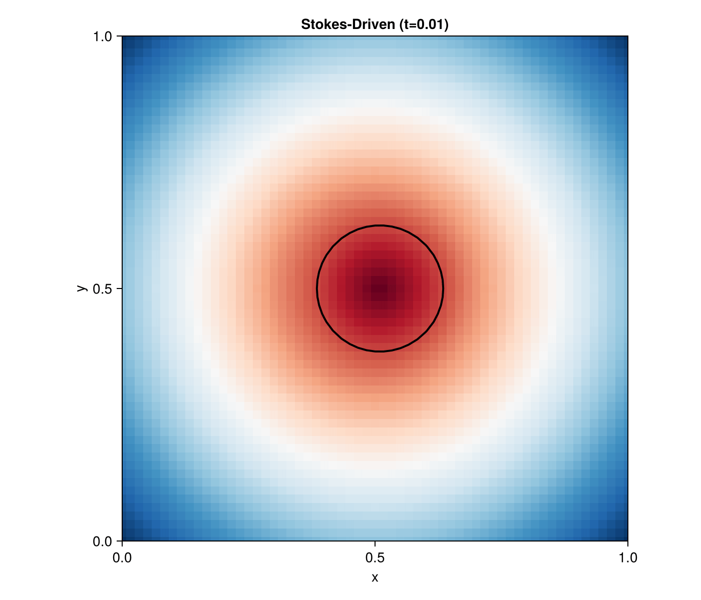

```@meta
EditURL = "../../../examples/stokes_driven_minimal.jl"
```

=============================================================================
Stokes-Driven Geometry — Minimal Example
=============================================================================

Demonstrates FEVelocitySource coupling: PDE-computed velocity drives
geometry evolution. A circle is advected by a Stokes flow.

This version uses a Cartesian grid for simplicity as the Quadtree backend
is no longer available in this minimal example.

=============================================================================

````@example stokes_driven_minimal
using EvolvingDomains
using Gridap
using GridapEmbedded
using LevelSetMethods
using CairoMakie
using LinearAlgebra: norm
````

Inline plot_levelset! from extension to avoid loading issues

````@example stokes_driven_minimal
function plot_levelset!(ax, geom;
                        colormap=:RdBu,
                        levels::Int=20,
                        show_zero::Bool=true,
                        linewidth::Real=2,
                        linecolor=:black,
                        ϕ_buffer::Union{Nothing, Vector{Float64}}=nothing)

    phi = EvolvingDomains.current_levelset(geom)
    info = EvolvingDomains.grid_info(geom)
    nx, ny = info.dims

    phi_2d = reshape(phi, nx, ny)

    ox, oy = info.origin
    dx, dy = info.spacing
    xs = range(ox, step=dx, length=nx)
    ys = range(oy, step=dy, length=ny)

    heatmap!(ax, xs, ys, phi_2d; colormap=colormap)
    if show_zero
        contour!(ax, xs, ys, phi_2d; levels=[0.0], color=linecolor, linewidth=linewidth)
    end
    return ax
end

println("═" ^ 60)
println("  Stokes-Driven Geometry — EvolvingDomains.jl V2")
println("  (Cartesian Grid Minimal Example)")
println("═" ^ 60)
````

==========================================================================
1. Setup Grid
==========================================================================

````@example stokes_driven_minimal
println("[Grid] Generating Cartesian Mesh...")
domain = (0.0, 1.0, 0.0, 1.0)
n_cells = (40, 40)
model = CartesianDiscreteModel(domain, n_cells)

println("[Grid] Domain is [0,1]x[0,1]")
````

==========================================================================
2. Create Evolving Geometry (circle)
==========================================================================
Use VectorValue for consistent type operations

````@example stokes_driven_minimal
center = VectorValue(0.5, 0.5)
radius = 0.125
````

We use a higher resolution grid for the level set evolution

````@example stokes_driven_minimal
lsm_model = CartesianDiscreteModel(domain, (60, 60))

geom = EvolvingDiscreteGeometry(model, lsm_model,
    x -> norm(VectorValue(x...) - center) - radius;
    reinit_freq = 0
)
````

==========================================================================
3. Create FE Velocity Field (Scalar Components)
==========================================================================

````@example stokes_driven_minimal
reffe_scal = ReferenceFE(lagrangian, Float64, 1)
V_scal = FESpace(model, reffe_scal)
````

Interpolate channel flow components: u_x = 4y(1-y), u_y = 0

````@example stokes_driven_minimal
function flow_u(x)
    y = x[2]
    return 4.0 * y * (1.0 - y)
end

function flow_v(x)
    return 0.0
end

u_h_x = interpolate(flow_u, V_scal)
u_h_y = interpolate(flow_v, V_scal)
````

==========================================================================
4. Velocity Coupling (FEVelocitySource)
==========================================================================
We use FEVelocitySource which is standard (GuidedVelocitySource requires Quadtree)

Let's create a vector FEFunction

````@example stokes_driven_minimal
reffe_vec = ReferenceFE(lagrangian, VectorValue{2,Float64}, 1)
V_vec = FESpace(model, reffe_vec)

flow_vec(x) = VectorValue(flow_u(x), flow_v(x))
u_h_vec = interpolate(flow_vec, V_vec)

vel = FEVelocitySource(u_h_vec)
update_velocity!(vel, u_h_vec, geom)
set_velocity!(geom, vel)

println("Velocity: Parabolic channel flow (max magnitude ≈ 1.0)")
````

==========================================================================
5. Simulation Parameters
==========================================================================

````@example stokes_driven_minimal
t_end = 0.75
dt = 0.01
n_steps = round(Int, t_end / dt)

println("Steps: $n_steps, Δt = $dt")
println("")
````

==========================================================================
6. Record Animation
==========================================================================

````@example stokes_driven_minimal
fig = Figure(size=(700, 600))
ax = Axis(fig[1, 1], aspect=1, limits=(0, 1, 0, 1),
            xlabel="x", ylabel="y",
            title="Stokes-Driven (t=0)")
````

Show velocity magnitude as background

````@example stokes_driven_minimal
xs = range(0, 1, length=50)
ys = range(0, 1, length=50)
````

Make vel_mag available for the loop

````@example stokes_driven_minimal
vel_mag_grid = [norm(flow_vec(VectorValue(x, y))) for x in xs, y in ys]

output_path = joinpath(@__DIR__, "stokes_driven_minimal.gif")

function step_stokes(step)
    t = step * dt
    advance!(geom, dt)
    empty!(ax)
    heatmap!(ax, xs, ys, vel_mag_grid; colormap=:blues, alpha=0.3)
    plot_levelset!(ax, geom)
    ax.title = "Stokes-Driven (t=$(round(t, digits=2)))"
end
````

Use named function instead of do block

````@example stokes_driven_minimal
record(step_stokes, fig, output_path, 1:n_steps; framerate=20)

println("✅ Animation saved to: $output_path")
println("═" ^ 60)
````



---

*This page was generated using [Literate.jl](https://github.com/fredrikekre/Literate.jl).*

